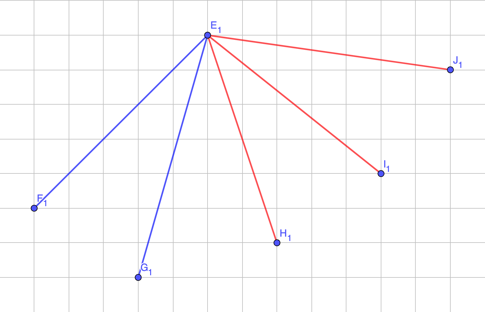
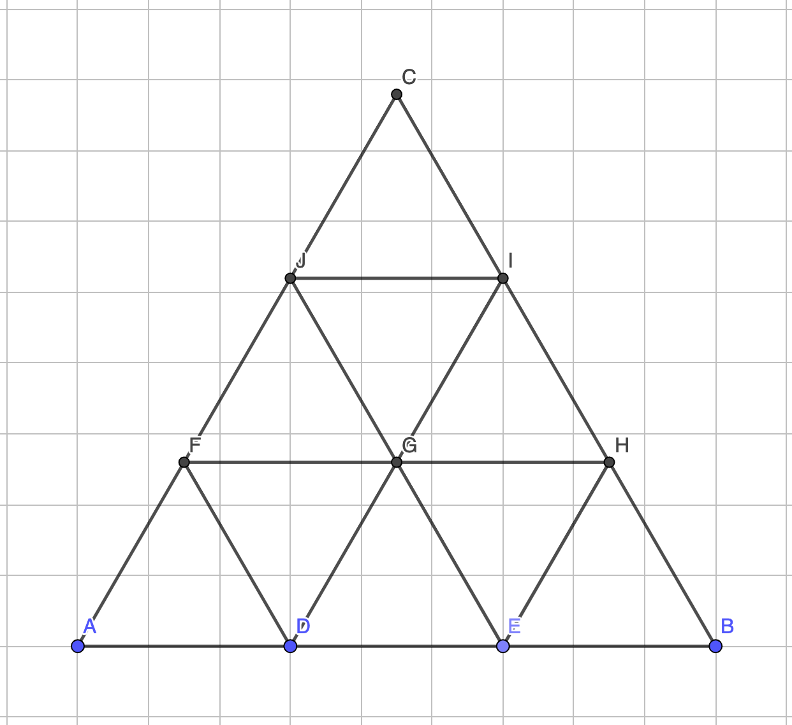

# Bài tập chương 5 toán rời rạc

## Bài 1

Trong mặt phẳng có 6 điểm được nối với nhau từng  đôi một bởi các cung màu xanh hoặc màu đỏ. Chứng  minh rằng luôn tìm được 3 điểm sao cho các cung nối chúng cùng một màu (tạo thành tam giác xanh hoặc đỏ)

Bài giài:

Mỗi điểm sẽ nối với $5$ điểm khác, vì mỗi đoạn thẳng chỉ có $1$ màu hoặc đỏ hoặc xanh nên theo định lí Dirichlet. Thì sẽ có ít nhất $\lceil 5 \div 2\rceil = 3$ đoạn thẳng cùng màu.

Xét $3$ đoạn thẳng có cùng màu (*ví dụ như đỏ*) lần lượt có tên là $AB, AC, AD$. Khi đó có:

- Nếu ít nhất một trong $3$ đoạn thẳng $BC, BD, CD$ có màu đỏ thì tồn tại một tam giác có màu đỏ.
- Ngược lại, nếu không có đoạn thẳng nào trong $3$ đoạn thẳng $BC, BD, CD$ có màu đỏ thì chắc chắn $3$ đoạn thẳng đó có màu xanh. Vậy tồn tại tam giác có $3$ đỉnh $B, C, D$ có $3$ cạnh màu xanh.

---

## Bài 2

Trong phòng họp, bao giờ cũng tìm được 2 người có số người quen trong số những người dự họp là bằng nhau.

Bài giải:

Giả sử, trong phòng họp có $n$ người và không tìm được $2$ người nào có số người quen trong phòng họp có số người quen giống nhau.

Nói cách khác ta có thể suy ra: Người thứ $i$ sẽ quen $i$ người trong phòng họp.

- Người thứ $1$ quen $1$ người trong phòng họp.
- Người thứ $2$ quen $2$ người trong phòng họp.
- Người thứ $3$ quen $3$ người trong phòng họp.
- $\ldots$
- Người thứ $n$ quen $n$ người trong phòng họp.

Song, nếu một phòng họp có đúng $n$ người thì một người bất kì trong phòng chỉ có thể quen tối đa $n - 1$ người khác nhau (trừ bản thân họ ra). Do đó, không thể tồn tại người thứ $n$ quen $n$ người trong phòng họp.

Do vậy giả thuyết ban đầu đặt ra là sai và luôn tìm được hai người có số người quen giống nhau và trong đoạn $[1, n - 1]$.

---

## Bài 3

Chứng minh rằng trên trái đất này luôn có ít nhất 2 người có hàm răng giống nhau.

Bài giải:

...

---

## Bài 4 - đề thi

Chứng minh rằng trong một tam giác đều có cạnh bằng 3 nếu thảy vào 10 hạt đậu thì chắc chắn có ít nhất hai hạt đậu cách nhau không quá 1 mét.

Bài giải:

Chia tam giác đều có cạnh bằng $3$ thành $9$ tam giác đều nhỏ hơn có cạnh bằng $1$.

Nếu bỏ vào mỗi tam giác ít nhất $1$ hạt đậu thì theo định lí Dirichlet sẽ có ít nhất $1$ tam giác có $2$ hạt đậu.

Mặt khác, tam giác nhỏ là tam giác đều có cạnh bằng $1$, do vậy, khoảng cách giữa hai hạt đậu trong tam giác có chứa ít nhất hai hạt đậu sẽ bé hơn $1$.

---

<!-- CSS_Style -->

